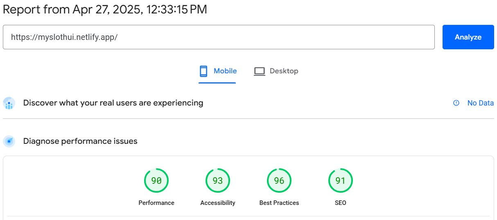
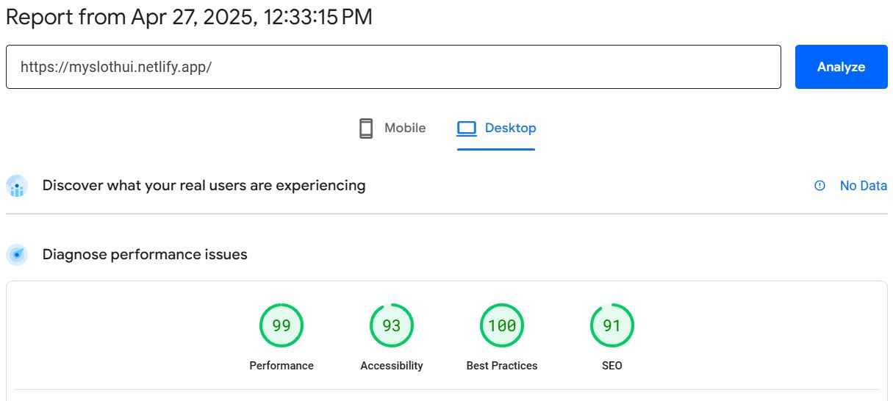

# slothui - A website Landing page Development Task for internship by [blinto🔗](https://blinto.co/)

## They provided Figma design and ask for below requirements

1. Use only Vanilla HTML, CSS, and JavaScript – You cannot use any CSS frameworks (like bootstrap, Tailwind) or JavaScript libraries/packages.
2. The website must be fully responsive and match the Figma design pixel-perfectly.
3. Write clean, well-structured, and maintainable code.

## Table of contents

- [Task Summary](#task-summary)
- [Site Analytics Report](#site-analetics-report)
- [Live Links](#links)
- [Built with](#built-with)
- [Author](#author)

## Task summary:

This was an awesome experience for me. This task helped me to strengthen my vanilla HTML, CSS, and JavaScript skills Because, For a couple of months, I was learning React.js, Tailwind CSS, Node.js, Express, and MongoDB.
With this task I have written,
<strong style="font-style: italic"> More than a thousand line of HTML, a thousand line of CSS and -- line of JavaScript code.</strong>

## Site Analytics Report

#### site Analytics in Mobile view: [Verify URL](https://pagespeed.web.dev/analysis/https-myslothui-netlify-app/lj61mhk2b8?form_factor=mobile)

#### Site Analytics in Desktop view: [Verify URL](https://pagespeed.web.dev/analysis/https-myslothui-netlify-app/lj61mhk2b8?form_factor=desktop)

### Links

- Project Live URL: [Live URL](https://myslothui.netlify.app/)
- My Portfolio URL: [Portfolio URL](https://merajsharif.netlify.app/#project)

### Built with

- HTML
- CSS
- JavaScript
- Mobile-first workflow
- Semantic HTML5 markup
- BEM

## Author

- LinkedIn - [@MerajSharif](https://www.linkedin.com/in/meraj-sharif-0413a6264/)
